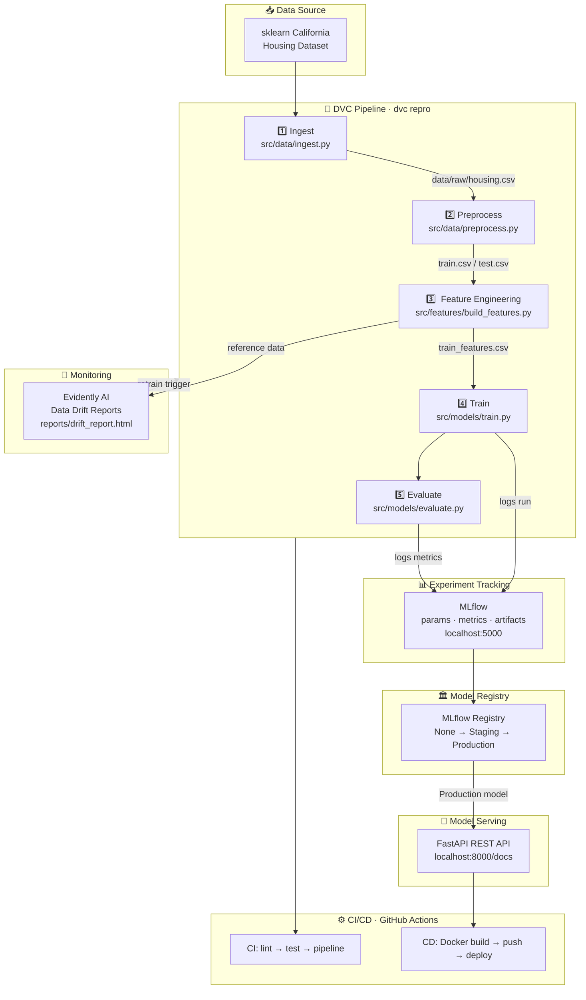

# House Price Predictor — MLOps Learning Project

> A complete, production-grade MLOps pipeline for predicting California house prices.
> Built as a learning reference for engineers transitioning from DevOps → MLOps.

---

## MLOps Flow Diagram



---

## What You'll Learn

| MLOps Concept | Where It's Implemented |
|---|---|
| **Reproducible pipelines** | `dvc.yaml` — every stage is tracked |
| **Data versioning** | DVC tracks `data/` — like git for data |
| **Experiment tracking** | MLflow logs every training run |
| **Model registry** | MLflow promotes models: None → Staging → Production |
| **Quality gates** | `evaluate.py` fails if R² or RMSE miss thresholds |
| **Model serving** | FastAPI REST API with auto-generated docs |
| **Containerization** | Docker + docker-compose for local stack |
| **CI/CD** | GitHub Actions runs lint → test → train on every push |
| **Drift monitoring** | Evidently AI detects when data distribution shifts |
| **Config management** | All hyperparameters in `params.yaml`, never hardcoded |

---

## Project Structure

```
house-price-predictor/
├── .github/workflows/       # CI (lint+test+train) and CD (Docker+deploy)
├── data/
│   ├── raw/                 # Stage 1 output: raw CSV (DVC-tracked)
│   └── processed/           # Stage 2-3 outputs: splits + features (DVC-tracked)
├── docker/                  # Dockerfiles for training and serving
├── metrics/                 # JSON metrics files (DVC-tracked, shown in PRs)
├── models/                  # Scaler artifact (DVC-tracked)
├── reports/                 # Evidently HTML drift reports
├── serve/                   # FastAPI application
│   ├── app.py               # Routes: /health, /info, /predict
│   └── schemas.py           # Pydantic request/response models
├── src/
│   ├── data/
│   │   ├── ingest.py        # Stage 1: fetch data from sklearn
│   │   └── preprocess.py    # Stage 2: clean + train/test split
│   ├── features/
│   │   └── build_features.py # Stage 3: engineer features + StandardScaler
│   ├── models/
│   │   ├── train.py         # Stage 4: train + MLflow logging
│   │   └── evaluate.py      # Stage 5: evaluate + quality gates
│   └── monitoring/
│       └── data_drift.py    # Evidently drift detection
├── tests/                   # pytest unit tests for each component
├── dvc.yaml                 # Pipeline DAG definition
├── params.yaml              # All hyperparameters (single source of truth)
├── docker-compose.yml       # MLflow + API local stack
├── Makefile                 # Developer shortcuts
└── pyproject.toml           # Dependencies + tool config
```

---

## Quick Start

### 1. Clone and install

```bash
git clone https://github.com/YOUR_USERNAME/house-price-predictor
cd house-price-predictor

python -m venv .venv
source .venv/bin/activate      # Windows: .venv\Scripts\activate

pip install -e ".[dev]"
pre-commit install
```

### 2. Initialize DVC

```bash
dvc init
```

### 3. Run the full MLOps pipeline

```bash
make pipeline
# Equivalent to: dvc repro
# Runs: ingest → preprocess → build_features → train → evaluate
```

### 4. View experiments in MLflow UI

```bash
make mlflow-ui
# Open http://localhost:5000
```

### 5. Start the prediction API

```bash
make serve
# Open http://localhost:8000/docs  ← interactive Swagger UI
```

### 6. Test a prediction

```bash
curl -X POST http://localhost:8000/predict \
  -H "Content-Type: application/json" \
  -d '{
    "med_inc": 3.5,
    "house_age": 20.0,
    "ave_rooms": 5.0,
    "ave_bedrms": 1.0,
    "population": 1000.0,
    "ave_occup": 3.0,
    "latitude": 37.88,
    "longitude": -122.23
  }'
```

### 7. Run the full local stack (MLflow + API) with Docker

```bash
make docker-compose-up
# MLflow UI: http://localhost:5000
# API docs:  http://localhost:8000/docs
```

---

## All Make Commands

```bash
make setup          # Install deps + pre-commit + init DVC
make lint           # Run pre-commit hooks (black, isort, flake8)
make test           # Run all tests with coverage
make pipeline       # Run full DVC pipeline (dvc repro)
make train          # Run training stage only
make evaluate       # Run evaluation stage only
make serve          # Start FastAPI dev server
make mlflow-ui      # Start MLflow tracking UI
make monitor        # Run Evidently drift detection
make metrics        # Show DVC metrics (dvc metrics show)
make dag            # Show DVC pipeline DAG
make docker-build   # Build serving Docker image
make docker-compose-up    # Start full stack (MLflow + API)
make docker-compose-down  # Stop full stack
make clean          # Remove all generated files
```

---

## Experiment Tracking with MLflow

Every training run automatically logs:
- **Parameters**: model type, n_estimators, max_depth, test_size
- **Metrics**: RMSE, MAE, R² (train and test)
- **Artifacts**: trained model (auto-registered in Model Registry)

```bash
# Compare runs
mlflow ui

# Promote a model to Production (after reviewing in UI)
# Or use the API:
python -c "
import mlflow
client = mlflow.tracking.MlflowClient()
client.transition_model_version_stage('house-price-model', 1, 'Production')
"
```

---

## Changing Hyperparameters

Edit `params.yaml` and re-run:

```bash
# Try gradient_boosting instead of random_forest
# In params.yaml: model.type: gradient_boosting

dvc repro           # Only re-runs affected stages
dvc metrics diff    # Compare with previous run
```

---

## Data Drift Monitoring

```bash
make monitor
# Opens reports/drift_report.html
# In production: run this on a schedule against new incoming data
```

---

## CI/CD Flow

| Event | Action |
|---|---|
| Push to any branch | Lint → Unit tests |
| PR to main | Lint → Tests → Run full pipeline → Post metrics as PR comment |
| Push to main | Build Docker image → Push to GitHub Container Registry |

---

## Dataset

**California Housing Dataset** (from `sklearn.datasets`)
- 20,640 samples, 8 features
- Target: median house value in a block (in $100,000s)
- No download needed — loaded directly from sklearn

| Feature | Description |
|---|---|
| `MedInc` | Median income (tens of thousands $) |
| `HouseAge` | Median house age in block |
| `AveRooms` | Average rooms per household |
| `AveBedrms` | Average bedrooms per household |
| `Population` | Block population |
| `AveOccup` | Average household occupancy |
| `Latitude` / `Longitude` | Block coordinates |

**Engineered features** (added in Stage 3):
- `rooms_per_household` — proxy for house size relative to age
- `bedrooms_per_room` — proxy for bedroom density
- `population_per_household` — proxy for household density
